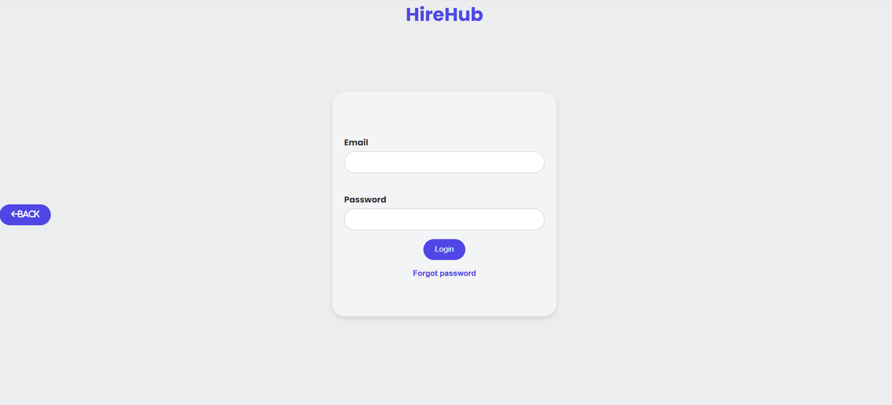
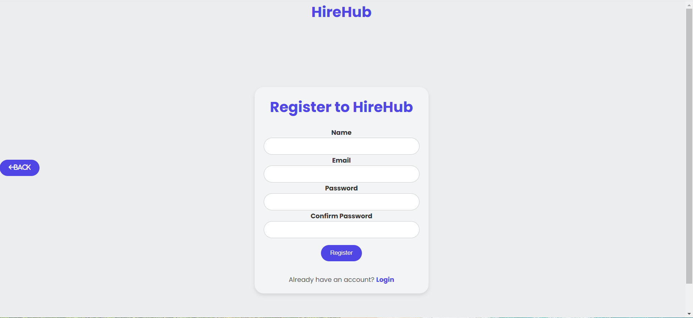

# 🚀 HireHub - Placement Portal

Welcome to **HireHub**, an intuitive placement portal built using **ReactJS**. HireHub helps students, recruiters, and administrators manage placement-related tasks efficiently.

---

## 📚 Project Overview
HireHub is designed to streamline the placement process by allowing:
- **👩‍🎓 Students** to register, log in, view placement opportunities, and manage their profiles.
- **💼 Recruiters/Administrators** to post and manage placement drives and student applications.

---

## ✨ Features
- **🔐 User Authentication:** Secure login and registration with form validation.
- **📊 Dashboard Access:** Protected routes for students and admins.
- **📝 Profile Management:** View and update user profiles.
- **📋 Placement Listings:** Browse and apply for placement drives.
- **📱 Responsive Design:** Modern UI that works seamlessly on all devices.

---

## 🛠️ Technologies Used
- ⚛️ ReactJS
- 🎨 CSS
- 🗄️ Git & GitHub for version control

*Backend (Upcoming):*  
- Node.js, Express, MongoDB, JWT, Bcrypt (to be integrated later)

---

## 📷 Screenshots
### 🏠 Home Page


### 🔐 Login Page


### 📝 Registration Page


---

## 🚀 How to Run Locally
1. Clone the repo:
```bash
git clone https://github.com/Sukhveer-001/HireHub.git

cd HireHub

npm install

npm run dev


🤝 Contributing
Feel free to open issues or contribute!

📧 Contact
For any queries, reach out at: techforindia03@gmail.com


